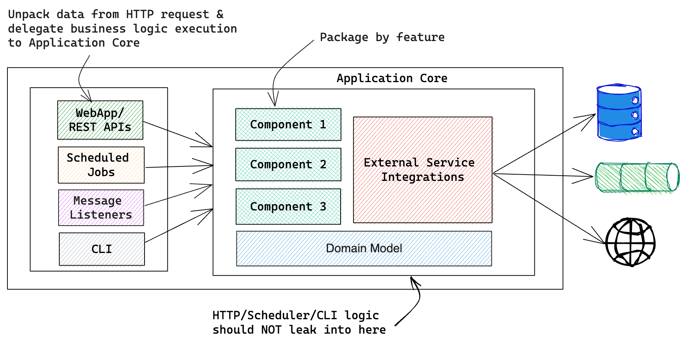

# Tomato Architecture
Tomato Architecture is an approach to software architecture following **Common Sense Manifesto**

## Common Sense Manifesto
* Think what is best for your software over blindly following suggestions by popular people.
* Strive to keep things simple instead of over-engineering the solution by guessing the requirements for the next decade.
* Do R&D, pick a technology and embrace it instead of creating abstractions with replaceability in mind.
* Make sure your solution is working as a whole, not just individual units.

## Architecture Diagram

## Implementation Guidelines

### 1. Package by feature
### 2. Keep "Application Core" independent of delivery mechanism (Web, Scheduler Jobs, CLI)
### 3. Separate the business logic execution from input sources (Web Controllers, Message Listeners, Scheduled Jobs etc)
### 4. Don't let the "External Service Integrations" influence the "Application Core" too much
### 5. Keep domain logic in domain objects
### 6. No unnecessary interfaces
### 7. Embrace the framework's power and flexibility
### 8. Test not only units, but whole features

## FAQs
1. **What's with the name "Tomato"?**
   
   If you are okay with "Hexagonal" knowing 6 edges has no significance, you should be okay with "Tomato".
   After all, we have Onion Architecture, why not Tomato:-)

2. **What if they call me "code monkey" for following this architecture?**

    Ignore them. Focus on delivering the business value.